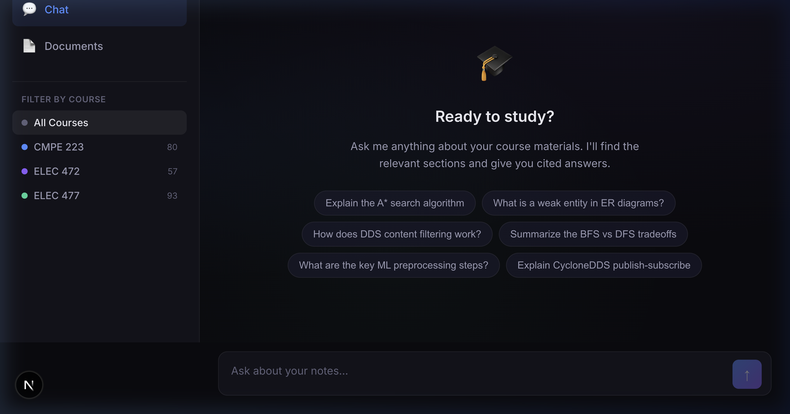
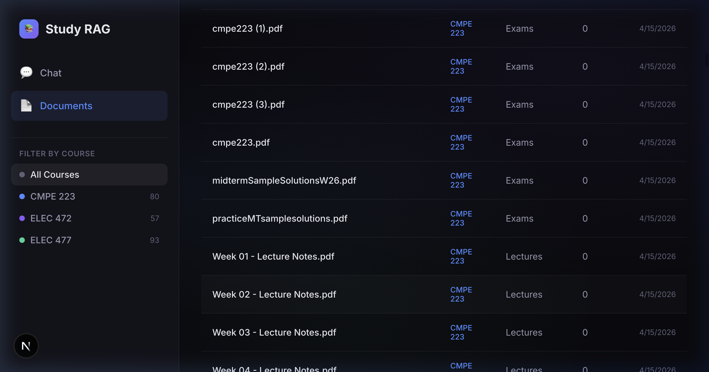

# RAG Study Notes System

A **Retrieval-Augmented Generation** system for chatting with your course notes, lecture slides, and study materials. Built for finals prep — ask questions, get accurate answers with source citations.

<p align="center">
  
  
</p>

**High-Performance Local Inference** — powered by Gemma4 26B via LM Studio networked GPU offloading. Complete privacy, zero cloud costs, maximum speed.


## Features

- 🔍 **Hybrid Search** — Semantic (vector) + BM25 keyword search with Reciprocal Rank Fusion
- 📚 **Multi-Format Ingestion** — PDF, DOCX, Markdown, TXT, HTML support
- 🧠 **Smart Chunking** — Heading-aware splitting for markdown, page-based for PDFs, sentence-boundary for text
- 💬 **Streaming Chat** — Real-time response streaming from Gemma4
- 📎 **Source Citations** — Every answer links back to the exact file and page
- 🔄 **Incremental Sync** — Auto-detects new/modified/deleted files via SHA-256 manifest
- 📁 **Drag & Drop Upload** — Add new files directly from the browser
- 🎯 **Course Filtering** — Scope questions to a specific course
- ⚡ **GPU Offloading** — Heavy generation and multimodal OCR bypass Mac RAM entirely and execute over the network on a dedicated Windows GPU.

## Architecture

```
┌─────────────────────────────────────────────────┐
│              Next.js Frontend (React)            │
│  Chat UI  ·  Document Browser  ·  Source Cards   │
└──────────────────────┬──────────────────────────┘
                       │ REST API (NDJSON streaming)
┌──────────────────────▼──────────────────────────┐
│            FastAPI Backend (Python)               │
│                                                   │
│  Ingestion:  Load → Chunk → Embed → ChromaDB     │
│  Retrieval:  Vector + BM25 → RRF Fusion          │
│  Generation: Gemma4 via LM Studio (streaming)     │
│                                                   │
│  LM Studio (Windows PC Server - 192.168.x.x)      │
│  ├── google/gemma-4-26b-a4b  → generation & OCR  │
│  └── nomic-embed-text        → embeddings        │
└──────────────────────────────────────────────────┘
```

## Tech Stack

| Layer | Technology |
|---|---|
| **LLM** | Gemma4 26B via LM Studio (OpenAI endpoint) |
| **Embeddings** | nomic-embed-text-v1.5 via LM Studio |
| **Vector DB** | ChromaDB (persistent, local) |
| **Keyword Search** | BM25 via rank-bm25 |
| **Reranking** | Reciprocal Rank Fusion (no model needed) |
| **Backend** | Python, FastAPI, uvicorn |
| **Frontend** | Next.js 16, React, TypeScript |
| **PDF Processing** | PyMuPDF (fitz) |
| **Doc Organization** | Custom Python script → Obsidian vault |

## Quick Start

### Prerequisites

- [LM Studio](https://lmstudio.ai/) running as a local server on a dedicated GPU machine:
  - Load `google/gemma-4-26b` for Vision/Chat
  - Load `nomic-embed-text-v1.5` for Embeddings
- Python 3.9+
- Node.js 18+

### Setup

```bash
# Clone
git clone https://github.com/erjon-musa/RAG_System.git
cd RAG_System

# Backend
python3 -m venv .venv
source .venv/bin/activate
pip install -r backend/requirements.txt

# Configure
cp .env.example .env
# Edit .env to set your VAULT_PATH

# Frontend
cd frontend && npm install && cd ..
```

### Run

```bash
# Terminal 1: Backend
source .venv/bin/activate
uvicorn backend.main:app --reload --port 8000

# Terminal 2: Frontend
cd frontend && npm run dev -- -p 3001
```

Open [http://localhost:3001](http://localhost:3001) to start chatting with your notes.

### First-Time Ingestion

1. Place your study materials in the vault directory (configured in `.env`)
2. Click **Sync Vault** on the Documents page, or hit the API:
   ```bash
   curl -X POST http://localhost:8000/api/documents/sync
   ```
3. Start asking questions!

## Adding New Files

Three ways to add content:

1. **Drop files in the vault folder** → Auto-detected on next query
2. **Drag & drop in the UI** → Documents page upload zone
3. **Click Sync** → Manual re-scan of vault directory

The system uses a SHA-256 manifest to track what's been ingested. Only new/modified files are processed — unchanged files are skipped instantly.

## API Endpoints

| Method | Endpoint | Description |
|---|---|---|
| `POST` | `/api/chat` | Streaming chat with source citations |
| `POST` | `/api/chat/simple` | Non-streaming chat (for testing) |
| `POST` | `/api/documents/sync` | Scan vault for changes and ingest |
| `POST` | `/api/documents/upload` | Upload file to vault + auto-ingest |
| `GET` | `/api/documents` | List indexed documents |
| `GET` | `/api/documents/stats` | Index statistics |
| `GET` | `/api/courses` | List courses with counts |
| `GET` | `/api/health` | Health check (doesn't load models) |

## Project Structure

```
RAG_System/
├── backend/
│   ├── main.py                 # FastAPI entry point
│   ├── ingestion/              # Load → Chunk → Embed → Store
│   │   ├── loader.py           # Multi-format document readers
│   │   ├── chunker.py          # Smart text chunking
│   │   ├── embedder.py         # nomic-embed-text via Ollama
│   │   └── pipeline.py         # Incremental ingestion orchestrator
│   ├── retrieval/              # Hybrid search engine
│   │   ├── vector_search.py    # ChromaDB semantic search
│   │   ├── keyword_search.py   # BM25 keyword search
│   │   ├── reranker.py         # Reciprocal Rank Fusion
│   │   └── retriever.py        # Unified retrieval interface
│   ├── generation/             # LLM generation
│   │   ├── llm.py              # Ollama Gemma4 client (streaming)
│   │   ├── prompts.py          # Study-focused system prompts
│   │   └── chain.py            # RAG chain: retrieve → generate
│   └── api/                    # REST endpoints
│       ├── chat.py             # Chat with streaming
│       ├── documents.py        # Document management
│       └── courses.py          # Course listing
├── frontend/                   # Next.js chat UI
├── scripts/
│   └── organize_vault.py       # Organize messy files → Obsidian vault
└── data/                       # ChromaDB + manifest (gitignored)
```

## Purpose

This project was built to explore and demonstrate **RAG architecture from scratch** — without relying on frameworks like LangChain. Every component (ingestion, chunking, embedding, retrieval, reranking, generation) is implemented manually to understand the full pipeline.

Built with a multi-agent workflow using Claude Code.

## License

MIT
